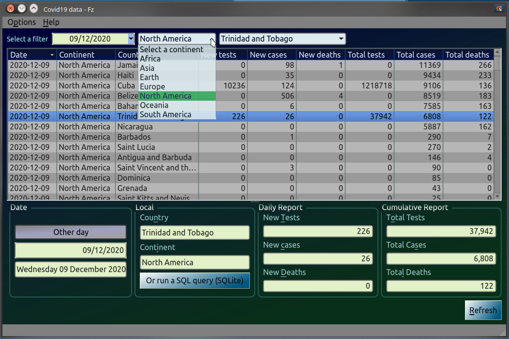

# Covid19  data  
    
Desktop application that shows data for the Covid 19 (cases, deaths, tests,....)

## Preview

|Preview |Preview |
|:-:|:-:|
|| |
|||

## Source, credit and license

Data used in this program are provided from the [owid (Our World in Data )](https://raw.githubusercontent.com/owid/covid-19-data/master/public/data/owid-covid-data.csv) Github :octocat: repository.

> All visualizations, data, and code produced by *Our World in Data* are completely open access under the [Creative Commons BY license](https://creativecommons.org/licenses/by/4.0/). You have the permission to use, distribute, and reproduce these in any medium, provided the source and authors are credited.
>
> In the case of our testing dataset, please give the following citation:
>
> Hasell, J., Mathieu, E., Beltekian, D. *et al.* A cross-country database of COVID-19 testing. *Sci Data* **7**, 345 (2020). https://doi.org/10.1038/s41597-020-00688-8

## :warning: ​Warning

The main branch is no longer named `master` but it's `main`.
